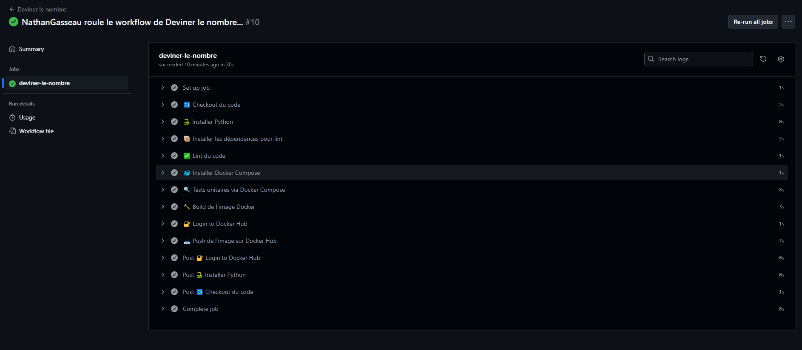

### ✍️ Auteur
- Nom : Nathan Gasseau
- Cours : LOG430-01
- Session : ÉTÉ 2025


# 🎯 Devine le Nombre

Cette application console Python simule un jeu où l'ordinateur devine automatiquement un nombre généré aléatoirement entre 1 et 100. En utilisant une stratégie de recherche dichotomique, le programme ajuste ses tentatives en fonction des indices reçus (« plus grand » ou « plus petit ») jusqu'à trouver le bon nombre. Aucune saisie manuelle n'est requise.

## 🔀 Choix de technologie
- Python : J’ai choisi d’utiliser Python comme langage de programmation, car il fonctionne bien dans un environnement Linux.

- Pytest : J’ai décidé d’utiliser la librairie Pytest, car je l’avais utilisée dans le passé et elle est relativement simple à prendre en main.
---

## 🔧 Instructions d’exécution

### Prérequis

- Python 3.10 ou plus récent
- Un terminal ou un IDE comme VS Code

### Étapes pour exécuter l'application

1. **Cloner le dépôt :**
   ```bash
   git clone https://github.com/NathanGasseau/LOG430-01.git
2. **Se placer dans le bon répertoire:**
   ```bash
   cd "LOG430-01"
5. **Construire le projet avec Docker Compose:**
   ```bash
   docker build -t devine-le-nombre .
5. **Lancer le jeu avec Docker Compose:**
   ```bash
   docker-compose run devine-le-nombre
# 📁 Structure du projet
    LOG430-01/
    │
    ├── src/                  # Contient le code source principal
    │   ├── __init__.py       # Fichier qui rend src un package
    │   └── main.py           # Script principal du jeu
    ├── tests/                # Contient les tests
    │   ├── __init__.py       # Fichier qui rend tests un package
    │   └── main_test.py      # Script de test du jeu
    │
    ├── .gitignore            # Fichiers à ignorer par Git
    ├── compose.yaml          # Fichier de config Docker Compose
    ├── Dockerfile            # Fichier de condig Docker
    ├── README.md             # Ce fichier
    └── requirements.txt      # Fichier contenant les packages à intstaller

# ✅ Exécution réussie de la pipeline CI/CD
#### Fonctionnement:

1. Ce workflow s'exécute automatiquement lors d’un push ou sur n’importe quelle branche ou lors d’une pull request.
2. Vérifie la qualité du code.
3. Exécute les tests dans un environnement Dockerisé.
4. Construit et publie automatiquement l’image Docker sur Docker Hub après chaque modification du code.

#### Démo exécution:

